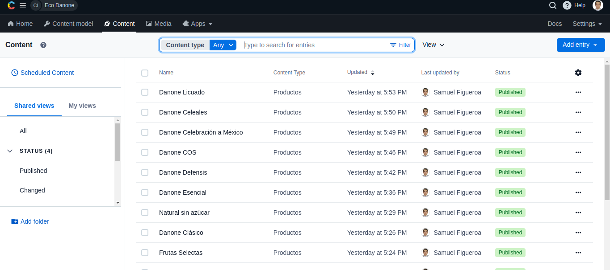

# Danone Eco

## Presentacion
Mi nombre es Samuel Espinoza, estudio actualmente sistemas computacionales, tengo 21 años y soy un apasionado por la programación y es un gusto para mí haber estado en su hackathon. Espero que mi proyecto sea de su agrado.


## Documentacion

He creado la siguiente pagina [Danone Eco](https://master--incandescent-fairy-64491e.netlify.app/).

He seguido las reglas utilizando como backend contentful que es unHeadless CMS lo utilice como gestor de contenido



## Project setup
```
npm install
```

### Compiles and hot-reloads for development
```
npm run serve
```

### Compiles and minifies for production
```
npm run build
```

### Customize configuration
See [Configuration Reference](https://cli.vuejs.org/config/).
