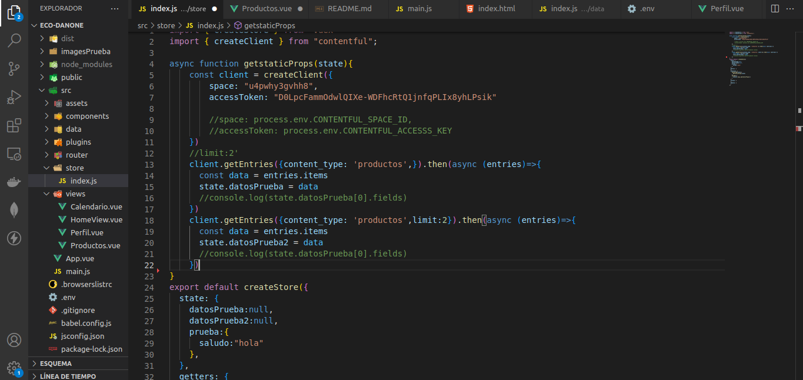
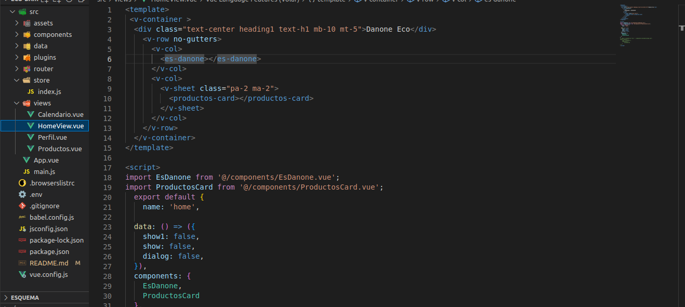
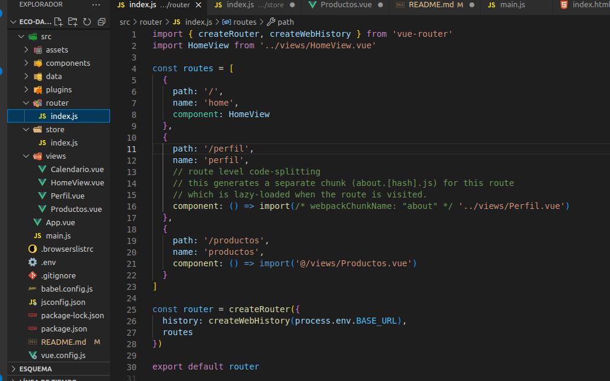
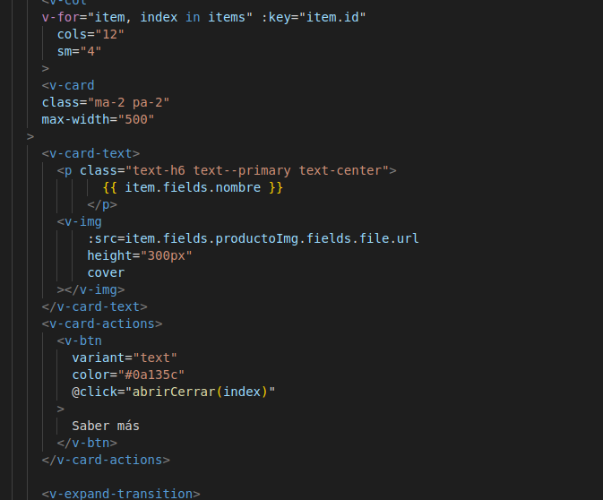
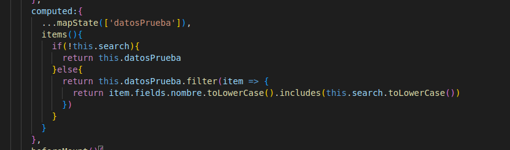

# Danone Eco

## Presentacion
Mi nombre es Samuel Espinoza, estudio actualmente sistemas computacionales, tengo 21 años y soy un apasionado por la programación y es un gusto para mí haber estado en su hackathon. Espero que mi proyecto sea de su agrado.


## Documentacion

He creado la siguiente pagina [Danone Eco](https://master--incandescent-fairy-64491e.netlify.app/).

He seguido las reglas utilizando como backend contentful que es unHeadless CMS lo utilice como gestor de contenido


Y posterior a esto lo consumo desde el store de vue esto con el fin de que se guarde en cache, tambien tengo claro que no se deberia de ver el space ni el token, si no que mediante variables de entorno ahi se deberian establecer, en fin, lo deje asi para que fuese comprobable el consumo real y si quieren pueden ver mis tablas hechas en contentful.


Dentro de mi front para el home utilice buenas practicas generando componentes reutilizables como lo serian mis productos.


Para el front genere unas rutas que me permitieran viajar atraves de las views.


Por ultimo me gustaria destacar que cuando muestro los productos lo hago de forma dinamica
1. primero leo cuantos objetos tiene mi arreglo
2. por cada arreglo itero una card
3. asigno sus datos propios y saco su index que me permitira dar click en el boton ver mas haciendo referencia al objeto con ese indice



tambien el apartado de busqueda lo logre crear con el metodo filter que me ayuda a filtar los valores que van en buscar que coincidan con el nombre que tiene la card


De esta forma solo cuando itero lo hago bajo esta funcion, asi logro filtar cuando haya algun input en el cambo de buscar, ademas que el valor lo guardo en una variable referenciada, lo cual me permite saber desde un inicio cuando cambia.

sin mas por el momento les agradezco la oportunidad de participar, si pueden darme alguna retroalimentacion leas agradeceria muchisimo, espero que tengan un buen dia, les dejo mi [Linkedin](https://www.linkedin.com/in/samuel-espinoza-figueroa-27b2a5209).

## Project setup
```
npm install
```

### Compiles and hot-reloads for development
```
npm run serve
```

### Compiles and minifies for production
```
npm run build
```

### Customize configuration
See [Configuration Reference](https://cli.vuejs.org/config/).
